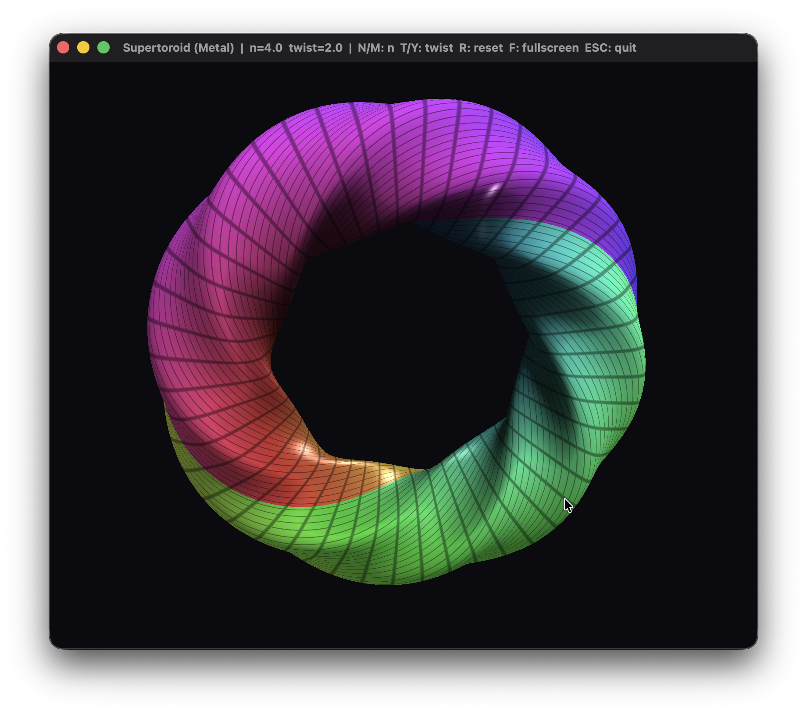

# Supertoroid (Metal)

A real-time GPU renderer for a **twisted supertoroid** — a torus whose circular
cross-section is replaced by a *superellipse* and rotated (twisted) as it sweeps around the
ring. Written in Swift with **Metal / MetalKit**, no third-party libraries.

This is the Metal rewrite of an earlier renderer that also exists in two OpenGL versions
(C++ / Win32 on Windows, Swift / AppKit on macOS). The CPU-side math and mesh generation are
shared; the GPU path is rebuilt natively against Metal.

## Screenshot


## The surface

The mesh is generated procedurally from these parametric equations:

```
R(v) = ( |cos v|^n + |sin v|^n ) ^ (-1/n)
phi  = t * u + v
x    = ( a + R * cos(phi) ) * cos(u)
y    = ( a + R * cos(phi) ) * sin(u)
z    =   R * sin(phi)
u, v ∈ [0, 2π]
```

- **`n`** — superellipse exponent (cross-section "squareness"): `n = 2` is a round torus,
  larger `n` is boxier.
- **`t`** — twist: how many times the cross-section rotates per full loop.
- **`a`** — major radius.

Vertex normals are computed by central finite differences of the position function, so they
stay correct for any `n` and `t`. At the default tessellation (`Nu = 256`, `Nv = 128`) the
surface is ~33k vertices / ~197k indices.

## Features

A single Swift file, no project required. Geometry is built on the CPU, uploaded once to
`MTLBuffer`s, and re-generated only when a parameter changes. Shading is done in Metal
Shading Language: a diffuse + specular + rim-light model over an animated rainbow hue, with
faint grid lines along the UV parameter space. The camera is a simple orbit/zoom with a real
depth buffer.

## Controls

| Input             | Action                          |
| ----------------- | ------------------------------- |
| Mouse drag        | Rotate                          |
| Scroll            | Zoom                            |
| `N` / `M`         | Decrease / increase exponent `n`|
| `T` / `Y`         | Decrease / increase twist `t`   |
| `R`               | Reset parameters and camera     |
| `F`               | Toggle fullscreen               |
| `Esc`             | Quit                            |

## Build

Requires macOS with a Metal-capable GPU (macOS 10.13+) and the Swift toolchain
(Xcode or the Command Line Tools).

Using the build script (also produces a `.app` bundle):

```bash
chmod +x build-metal.sh
./build-metal.sh          # build
./build-metal.sh --run    # build and launch
```

Or compile directly:

```bash
swiftc supertoroid-metal.swift -o supertoroid-metal \
       -framework Cocoa -framework Metal -framework MetalKit
./supertoroid-metal
```

Unlike the OpenGL versions, this one uses the native Apple GPU API, so it builds without any
deprecation warnings.

## Implementation notes

The renderer uses MetalKit's `MTKView` with an `MTKViewDelegate` driving the frame loop, a
render pipeline state built from MSL functions compiled at runtime
(`device.makeLibrary(source:)`), an explicit depth-stencil state, and an `MTLVertexDescriptor`
that maps the interleaved vertex buffer (position / normal / uv, 32-byte stride). Per-frame
uniforms are passed inline with `setVertexBytes` / `setFragmentBytes`; the Swift `Uniforms`
struct uses `simd` types so its memory layout matches the MSL `Uniforms` struct.

The one correctness detail worth calling out versus the OpenGL versions: Metal's clip-space
depth range is **[0, 1]** (near → 0, far → 1), not OpenGL's **[-1, 1]**, so the perspective
matrix is built accordingly. Everything else — the column-major matrix math
(`mvp = proj · view · model`), the procedural mesh, and the outward-normal convention — is
identical to the OpenGL build.

Back-face culling is left disabled; the depth buffer alone resolves visibility for this
closed surface. The source notes how to enable it (`.back` culling with `.clockwise` front
winding, since Metal judges winding in framebuffer space, which is y-flipped relative to NDC).

## License

MIT

## Support

If you found this project interesting or useful, you can support my work:

[](https://github.com/sponsors/makarov-mm)
